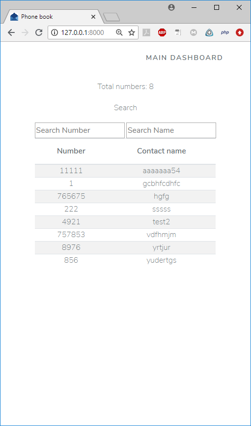

## Задача
Сделать RESTful API телефонного справочника c использованием фреймворка Laravel.

Описание:
API должно содержать методы для совершения всех CRUD операций, необходимых, чтобы обеспечить функциональность самого просто телефонного справочника.
Также необходимо сделать страницу для вывода информации из справочника (в самом простом виде).
Обеспечить возможность фильтрации по имени и номеру телефона.

## Использованы
- Laravel 5.8
- jQuery 3.3.1 (подключена ради AJAX)
- Bootstrap 4.1.3 (компонент Ларавела)
- Шрифты Nunito (основной) и font-awesome (иконки на кнопках)

## Реализовано
1. Две страницы: корневая предназначена для просмотра контактов и доступна всем, а **/admin/number** предназначена для редактирования списка и доступна только зарегистрированным пользователям. Общедоступной управляет **PhonebookController**, у которого из методов только index(). Страницей для редактирования управляет **Admin/NumberController**, имеющий методы для всех действий с контактами.
2. Сделан AJAX поиск по контактам без перезагрузки страницы. Джава-скрипт перехватывает событие onkeyup и вызывает **Ajax/AjaxController**, который и ищет подходящие контакты.
3. Счётчик контактов. Обновляется при поиске.
4. Валидация полей при добавлении и редактировании контактов. Сделана через **BaseModel**, от которой наследуется модель **Number**. Поля:
    - Номер: обязательное, цифровое, уникальное.
    - Имя: обязательное, допустимы только буквы, цифры, дефис и символ подчёркивания.
5. Все тексты вынесены в языковые файлы.

## Скриншоты

## FAQ
Q: Почему на странице просмотра контактов используется один поисковый скрипт, а на странице редактирования другой?

A: Для демонстрации разных возможностей: количесвто контактов, удовлетворяющих заданным условиям можно передавать во вью из контроллера, а можно вычислять уже в нём. Сам список контактов при этим можно формировать целиком, а можно манипулировать CSS свойствами строк и скрывать/показывать нужные.

